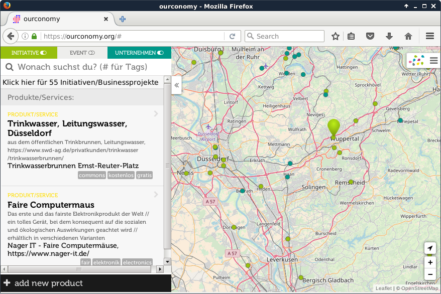

# Hey, this is ourconomy!

[ourconomy.org](https://ourconomy.org) brings you the stuff you need and lets you shape your world for the better. You can see how sustainable products and services are and evaluate them yourself. You can also enter products/services to show their positive achievements. 

This web application that supports consumers and producers by connecting them to relevant information and to each other. It allows us to build the economy in a way that is good for us.

The frontend is based on the seminal project [Karte von morgen](https://github.com/flosse/kartevonmorgen). Departing from but staying close to this codebase, it is dedicated to the development of the products/services functionalities.  

## Development

Technically, the start of this fork was to replicate virtually everything that exists in the codebase for 'entries' also to 'products'. The ResultList component and its items could be reused. 

Products and services are currently called _products_.

### Backend

The special backend for this version of the map is [openFXDB](https://github.com/ourconomy/openfairdb). 

### Dependencies

To be able to start developing you'll need the following tools:

- [git](https://www.git-scm.com/)
- [Node.js](https://nodejs.org/) version 6.x
- [npm](https://www.npmjs.com/package/npm) version 3.x
- [OpenFairDB](https://github.com/flosse/openfairdb)

Now clone this repository:

    git clone https://github.com/ourconomy/ourconomy

Go to the root of it and install all the dependencies:

    cd ourconomy/
    npm install

### Build

To build the web application run:

    npm run pack

The result can be found in `dist/`.

If you like Nix OS, please go to [Karte von morgen](https://github.com/flosse/kartevonmorgen) where Markus has some useful information for you.

### Local development setup

Go to [openFXDB](https://github.com/ourconomy/openfxdb) and follow the instructions for getting the sources and compilation.

When the database is listening on port 6767 of your host you were successful. Now,

    cd /path/to/kartevonmorgen/
    npm start

The web app is now listening on port 8080.
Open it in your browser `http://localhost:8080`.

On every file change in `src/`, the app will be build
for you and the browser reloads automatically.

### Tests

Tests can be found in the `spec/` folder.
To run the tests type

    npm t

## License

Copyright (c) 2015 - 2018 [Markus Kohlhase](mailto:mail@markus-kohlhase.de), David Ziegler, Oliver Sendelbach

This project is licensed under the [AGPLv3 license](http://www.gnu.org/licenses/agpl-3.0.txt).
